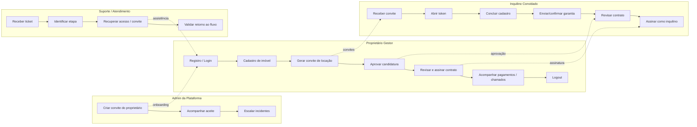

# Jornadas e backlog técnico — visão operacional (4 personas)

Mapeia a experiência completa do produto por persona — incluindo as duas internas (Admin, Suporte) que não aparecem no recorte de negócio de [`jornadas-e-prioridades-negocio.md`](jornadas-e-prioridades-negocio.md) — e o backlog de execução derivado, ranqueado por **impacto × complexidade × risco** (critério de sequenciamento de sprint, diferente do critério "peso por persona de receita" do documento irmão). Os dois documentos coexistem de propósito: este responde "em que ordem construímos", aquele responde "o que importa mais pra quem paga a conta".

---

## 1. Personas

### Persona A — Proprietário Gestor (principal no MVP)
**Quem é**: proprietário pessoa física ou pequena administradora, quer organizar imóveis e contratos com pouco tempo.
**Objetivos**: entrar rapidamente na plataforma; cadastrar imóvel sem burocracia; convidar inquilino certo; formalizar contrato e acompanhar status.
**Critérios de sucesso**: consegue ir de cadastro a contrato assinado sem suporte; visualiza status do imóvel e contrato em poucos cliques.

### Persona B — Inquilino Convidado
**Quem é**: locatário convidado pelo proprietário, com baixa tolerância a fricção.
**Objetivos**: concluir cadastro/acesso com segurança; enviar dados mínimos e assinar convite/contrato; entender claramente o próximo passo.
**Critérios de sucesso**: conclui cadastro + assinatura sem precisar de ajuda; recebe confirmação clara de conclusão.

### Persona C — Admin da Plataforma (operacional)
**Quem é**: operação interna que habilita onboarding inicial de proprietários e suporte.
**Objetivos**: convidar proprietário com confiabilidade; reduzir chamados de suporte em onboarding; monitorar sucesso/erro por etapa.
**Critérios de sucesso**: alta taxa de aceitação de convite; baixo volume de tickets por erro de convite/autenticação.

### Persona D — Suporte/Atendimento (interna)
**Quem é**: time que ajuda quando há falhas de acesso, convite e assinatura.
**Objetivos**: diagnosticar rapidamente em qual etapa o usuário travou; orientar recuperação de fluxo sem intervenção técnica.
**Critérios de sucesso**: MTTR baixo para problemas de acesso/convite; playbook claro por tipo de incidente.

---

## 2. Fluxos por persona (estado atual)

### A) Proprietário Gestor
- **Registro/login**: self-service (nome, CPF/CNPJ opcional, e-mail, senha) ou via convite; sessão local após autenticar.
- **Cadastro de imóvel**: endereço, cidade, matrícula, tipo, quartos/banheiros/vagas/m²/IPTU, autofill de CEP.
- **Navegação por hubs (Tabs)**: Imóveis, Contratos, Pagamentos, Convites, Candidaturas — cada hub lista os registros do proprietário logado com ações rápidas (reenviar/revogar convite, aprovar/recusar candidatura, confirmar pagamento). Perfil (avatar no header) e detalhe de inquilino acessíveis fora da tab bar.
- **Revisão e assinatura de contrato**: revisa dados, anexa/substitui documento do contrato e de garantia (upload real, Azure Blob Storage), assina, acompanha status até assinatura total.
- **Perfil**: avatar, telefone, CPF/CNPJ, troca de senha proativa (`(owner)/perfil/index.tsx`).
- **Logout**: invalida token no backend e limpa sessão local mesmo se a chamada de rede falhar (trade-off intencional).

**Fricções restantes**: sem wizard guiado de primeiros passos (rank 6, não iniciado).

### B) Inquilino Convidado
- **Acesso por convite de locação** (`(contrato)/locacao/[token].tsx`): cadastra (username/CPF/e-mail/senha) em uma chamada, ou vincula se já tem conta; se o convite exige garantia, envia tipo + dados e pode anexar comprobatório já nesta etapa; acompanha status da candidatura na mesma tela.
- **Assinatura de locação / revisão de contrato** (`(contrato)/[id]/revisar.tsx`): revisa resumo, confere/anexa documentos, assina, recebe confirmação.
- **Home do inquilino** (`(tenant)/tenant/index.tsx`): contratos com status, convites pendentes com aceite, dados de imóvel/proprietário resolvidos por extenso (sem UUID cru).
- **Meus pagamentos** (`(tenant)/tenant/pagamentos.tsx`): lista os próprios pagamentos por contrato.
- **Chamados** (`(tenant)/tenant/chamados.tsx`): abre chamado (categoria + descrição) e acompanha os já abertos — só permitido se o inquilino tiver contrato ativo na unidade do imóvel.
- **Perfil e avatar** (`(tenant)/tenant/perfil.tsx`): rota própria, sem colidir com a do proprietário.

**Fricções restantes**: nenhuma conhecida no caminho principal — a jornada completa do inquilino no frontend (rank 1) está fechada.

### C) Admin da Plataforma
- **Convite de onboarding de proprietário**: cria convite, sistema gera token, proprietário recebe link/token por canal operacional e conclui cadastro.

**Fricções restantes**: envio transacional real (SMTP/Resend) ainda depende de chave/domínio válidos em produção; sem observabilidade de funil (rank 2).

### D) Suporte/Atendimento
- **Recuperação operacional de convite** (ambiente de teste): busca token em endpoint de suporte, reenvia para usuário de teste.

**Fricções restantes**: recursos de suporte em produção dependem de canais operacionais fora do escopo MVP; sem painel de diagnóstico próprio (a auditoria de convite hoje é via `GET /convites/{token}/eventos`, exposta ao proprietário, mais consulta direta ao banco — ver [`playbook-suporte-acesso.md`](playbook-suporte-acesso.md)).

---

## 3. Estado alvo da especificação (to-be)

- **Proprietário**: tudo do estado atual, mais alertas proativos (e-mail/push) de garantia/reajuste/vencimento — hoje só há sinalização visual client-side.
- **Inquilino**: tudo do estado atual — caminho completo já fechado.
- **Admin**: trilha de auditoria de convites/aceites; monitoramento de SLA por etapa.
- **Suporte**: painel de diagnóstico por jornada; ações guiadas de recuperação (reenvio de convite, expiração, reabertura).

---

## 4. Journey map por etapa (cross-persona)

| Etapa | Persona líder | Risco de abandono | Oportunidade de melhoria |
|---|---|---|---|
| Descoberta/Convite | Admin / Proprietário | Médio | Mensagens mais claras de próximo passo |
| Cadastro/Aceite | Proprietário / Inquilino | Alto | Validação progressiva + exemplos inline |
| Primeiro acesso | Proprietário | Médio | Checklist "primeiros 5 minutos" (rank 6) |
| Operação inicial | Proprietário | Médio | Wizard guiado por etapas (rank 6) |
| Contratação | Proprietário + Inquilino | Alto | Resumo executivo + cláusulas destacadas |
| Pós-assinatura | Proprietário | Médio | ✅ painel com KPIs, toggles de urgência e alerta proativo por e-mail/push (rank 4) |
| Suporte | Suporte interno | Alto | Telemetria de funil + códigos de erro amigáveis (✅ erros, rank 3 concluído; telemetria, rank 2 em aberto) |

## 5. Fluxos críticos (prioridade de produto)

1. Convite/Aceite de acesso
2. Login + sessão + logout seguro
3. Cadastro de imóvel
4. Convite de locação e candidatura
5. Aprovação + geração de contrato
6. Assinatura das partes
7. Geração e acompanhamento de pagamentos

## 6. KPIs recomendados por persona

**Proprietário**: taxa de conclusão cadastro → primeiro imóvel criado; tempo médio login → convite emitido; taxa de contratos assinados após convite.
**Inquilino**: taxa de conclusão do convite; tempo médio para assinatura; taxa de abandono por etapa.
**Admin/Suporte**: taxa de aceitação de convites de onboarding; volume de tickets por etapa; tempo médio de resolução de incidentes de acesso.

*(Nenhum destes é medido automaticamente hoje — depende do rank 2, instrumentação de funil.)*

## 7. Matriz RACI

Legenda: **R** = Responsible, **A** = Accountable, **C** = Consulted, **I** = Informed

| Etapa / Fluxo | Proprietário Gestor | Inquilino Convidado | Admin da Plataforma | Suporte / Atendimento |
|---|---|---|---|---|
| Convite de onboarding do proprietário | I | I | A/R | C |
| Registro/login do proprietário | A/R | I | I | C |
| Cadastro de imóvel | A/R | I | I | I |
| Geração de convite de locação | A/R | I | I | I |
| Cadastro do inquilino via convite | I | A/R | I | C |
| Envio/validação de garantia | I | A/R | I | C |
| Aprovação de candidatura | A/R | I | I | C |
| Revisão/assinatura de contrato | A/R | A/R | I | I |
| Geração e acompanhamento de pagamentos | A/R | I | I | I |
| Gestão de chamados | A/R | A/R | I | C |
| Logout / encerramento de sessão | A/R | A/R | I | I |
| Recuperação de convite / incidente de acesso | I | I | I | A/R |

## 8. Diagramas (Mermaid)

## 9. Dor, oportunidade e requisito

| Etapa | Dor principal | Oportunidade | Status |
|---|---|---|---|
| Convite de onboarding | Usuário não sabe o próximo passo | Orientar com CTA claro e status visível | Em aberto |
| Registro / login | Erros de credencial e cadastro geram abandono | Mensagens de erro orientadas a ação | ✅ Resolvido (rank 3 — [`catalogo-erros-api.md`](catalogo-erros-api.md)) |
| Cadastro de imóvel | Formulário pode parecer longo | Reduzir esforço com campos mínimos e feedback imediato | Em aberto |
| Geração de convite de locação | Proprietário não entende se convite foi criado | Mostrar token/status e permitir retomada | Resolvido no hub de Convites |
| Garantia | Garantia é um ponto jurídico sensível | Permitir apenas um tipo de garantia por contrato | ✅ Resolvido (regra de domínio) |
| Aprovação de candidatura | Processo depende de conferência manual | Bloquear aprovação com contrato sobreposto na unidade | ✅ Resolvido (regra de domínio) |
| Pagamentos | Estado financeiro é difícil de entender | Consolidar status em um painel único | ✅ Resolvido (KPIs + totais nos hubs) |
| Chamados | Suporte é reativo e fragmentado | Fluxo de chamados por imóvel com status atualizado | ✅ Resolvido (ambos os lados) |
| Logout | Encerramento de sessão precisa ser confiável e consistente | Garantir saída local e servidor, com feedback explícito | ✅ Resolvido (rank 8 — hook único `useLogout`, confirmação na tela de login) |
| Recuperação de acesso | Convite expirado ou perdido trava o fluxo | Fluxo de suporte para localizar/recuperar convites | ✅ Resolvido (rank 5 — renovação automática no reenvio, mensagens distintas por estado, playbook de suporte) |

---

## 10. Backlog priorizado (ranking executivo)

Escala: Impacto 1–5, Complexidade 1–5, Risco de não fazer 1–5. Prioridade final ordena por impacto e complexidade, desempate por risco.

| Rank | Frente | Impacto | Complexidade | Risco | Prioridade | Status |
|---|---:|---:|---:|---:|---|---|
| 1 | Jornada completa do inquilino no frontend | 5 | 5 | 5 | P0 | ✅ **Concluído** |
| 2 | Instrumentação de funil por persona (telemetria) | 5 | 4 | 5 | P0 | Não iniciado |
| 3 | Padronização de erros por etapa da jornada | 4 | 4 | 4 | P1 | ✅ **Concluído** |
| 4 | Painel de status acionável pós-assinatura | 4 | 3 | 4 | P1 | ✅ **Concluído** — KPIs, totais e toggles de urgência em todos os hubs, mais alerta proativo por e-mail/push (job diário) |
| 5 | Fluxo robusto de recuperação de acesso/convites | 4 | 3 | 4 | P1 | ✅ **Concluído** |
| 6 | Wizard guiado no fluxo operacional do proprietário | 3 | 3 | 3 | P2 | Não iniciado |
| 7 | Hardening de contratos de API e permissões por persona | 3 | 3 | 3 | P2 | ✅ **Concluído** |
| 8 | Ajustes finos de UX em logout e mensagens contextuais | 2 | 2 | 2 | P3 | ✅ **Concluído** |

### Rank 1, 3, 4, 5, 7 e 8 — concluídos

- **Rank 1** (jornada do inquilino): cadastro por convite, garantia (com upload já na candidatura), candidatura, assinatura, home, perfil, **pagamentos** (`(tenant)/tenant/pagamentos.tsx`) e **chamados** (`(tenant)/tenant/chamados.tsx`) — todos com UI própria e E2E cobrindo o caminho principal ponta a ponta.
- **Rank 3** (erros): catálogo de códigos → mensagem de ação em [`catalogo-erros-api.md`](catalogo-erros-api.md); `getErrorMessage()` centralizado em `frontend/src/api/client.ts`, adotado em todas as telas que tratam erro de API.
- **Rank 4** (painel de status): hub de Imóveis com KPIs de carteira (renda mensal recorrente, taxa de ocupação, inadimplência do mês) e card com aluguel vigente + foto; hub de Contratos com totais (receita recorrente, assinados, pendentes) e toggle "vencendo em ≤60 dias"; hub de Pagamentos com totais do mês e exportação CSV; toggle "precisa de atenção" consistente em Convites, Pagamentos, Contratos e Imóveis; e alerta proativo por e-mail + push (`AlertasVencimentoScheduler`, job diário) pra contrato (60d), garantia (30d) e conta (5d) — cada um com sua própria flag de "já enviado" pra não duplicar. O canal de push depende de um projeto EAS ainda não provisionado (`extra.eas.projectId`); até lá, só o e-mail funciona de fato — ver `README.md` "O que não está neste MVP".
- **Rank 7** (hardening): auditoria completa dos 11 controllers em [`matriz-acesso-por-rota.md`](matriz-acesso-por-rota.md), duas vulnerabilidades de posse corrigidas (chamados sem checar relação inquilino↔imóvel), e `IdorAccessControlIT.java` cobrindo acesso cross-tenant com 404.
- **Rank 5** (recuperação de acesso): `ConviteResponse`/`ConviteAcessoResponse` ganharam `expirado` computado server-side (o domínio nunca grava `EXPIRADO` de verdade — é sempre derivado de `expiraEm` vs. agora); `Convite.renovar()` estende o prazo em 7 dias sem trocar o token, acionado automaticamente por `POST /convites/{token}/reenviar` quando o convite está expirado e ainda `PENDENTE`; reenvio sem repetir e-mail/telefone no corpo reaproveita o último destino; `CriarConviteAcessoProprietario` deixou de criar convites de onboarding duplicados pro mesmo e-mail (reaproveita o pendente existente); trilha de auditoria mínima (`eventos_auditoria`, ver `EventoAuditoria`) registra todo o ciclo de vida dos dois tipos de convite, exposta ao proprietário via "Ver histórico" no hub de Convites; telas de convite (`(auth)/convite/[token].tsx`, `(contrato)/locacao/[token].tsx`) mostram mensagem distinta por estado (expirado/consumido/revogado/recusado) em vez de erro genérico, com CTA de recuperação onde existe (proprietário → `/register`; inquilino → pedir reenvio ao proprietário, que já é self-service no hub). Runbook completo em [`playbook-suporte-acesso.md`](playbook-suporte-acesso.md).
- **Rank 8** (logout e contexto): consertado junto **um bug real encontrado ao verificar as telas** — os hubs de Imóveis e Contratos tinham o toggle "precisa de atenção" com default `true`, e o critério desses dois (vago há mais de 30 dias / vencendo em ≤60 dias) exclui justamente os imóveis alugados e os contratos saudáveis, ou seja, a maior parte do patrimônio ativo do proprietário — quem abria a tela pela primeira vez via a lista aparentemente vazia mesmo tendo imóveis/contratos cadastrados. Default trocado pra `false` (mostra "Todos") nos dois; Pagamentos e Convites mantidos como estavam (lá o filtro exclui itens historicamente concluídos/futuros, não o núcleo ativo do negócio). Além disso: logout consolidado num hook único (`useLogout`, `frontend/src/hooks/`) usado pelo header do proprietário e pela home do inquilino, com feedback explícito na tela de login ("Você saiu da sua conta.") — antes era um redirect silencioso; `apiFetch` passou a redirecionar pro login em qualquer 401 de chamada autenticada, de forma central (antes só uma tela tratava isso manualmente, o resto deixava a sessão morta sem avisar); descoberto e corrigido um bug latente nesse processo — `POST /auth/senha/trocar` com a senha atual errada também devolve 401/AUTH_INVALID, e antes disso derrubava a sessão válida do usuário sem explicação; agora usa `preserveSessionOn401` pra não confundir "senha atual errada" com "sessão morta"; e feedback de sucesso explícito adicionado em salvar CPF/CNPJ e telefone no perfil do proprietário (só o botão saindo do loading não bastava como confirmação). **Segundo bug real, encontrado em relato de usuário após o fix acima**: mesmo com o default corrigido, a lista de Imóveis continuava sumindo em janelas de navegador mais baixas — `(owner)/imoveis/index.tsx` era a única tela do hub a usar `FlatList` como filho direto da `View` raiz (`flex-1`), em vez do `ScrollView` usado por Contratos/Pagamentos/Convites; sem um container com altura delimitada envolvendo o conteúdo, a página não rolava e tudo abaixo das duas primeiras fileiras de filtro (terceira pill row + a lista/estado vazio inteiros) ficava cortado e inacessível, embora presente no DOM. Corrigido trocando `FlatList` por `ScrollView` + `.map()`, no mesmo padrão das outras telas do hub — confirmado via Playwright em viewport curto (1358×580): antes, nada rolava (scroll da página travado, `document.body` com `overflow: hidden` e altura igual à viewport); depois, a rolagem interna do `ScrollView` revela a pill e o card do imóvel normalmente.

### Rank 2 — Instrumentação de funil por persona (P0, não iniciado)
**Escopo**: eventos de entrada/saída por etapa crítica; correlação por persona e jornada; indicadores de abandono e tempo por etapa.
**Dependências**: definição de taxonomia de eventos; decisão de destino de logs/métricas.
**Entregáveis**: catálogo de eventos versionado; eventos disparados em pontos críticos do frontend e backend; visão inicial de funil por persona.
**Critério de pronto**: KPIs do journey (seção 6) calculáveis automaticamente; suporte consegue localizar etapa de falha com evidência.

### Rank 6 — Wizard operacional do proprietário (P2, não iniciado)
**Escopo**: guia de primeiros passos; navegação orientada imóvel → convite → candidatura → contrato.
**Entregáveis**: checklist operacional; marcadores de progresso derivados de dado já existente (`GET /imoveis`, `/convites`, `/contratos`) — não precisa de estado novo no backend.
**Critério de pronto**: redução de abandono no primeiro uso.

---

## 11. Sequenciamento sugerido (ondas)

- **Onda 1 (P0)**: Rank 1 ✅, Rank 2
- **Onda 2 (P1)**: Rank 3 ✅, Rank 4 ✅, Rank 5 ✅
- **Onda 3 (P2/P3)**: Rank 6, Rank 7 ✅, Rank 8 ✅

## 12. Riscos e mitigação

- **Divergência entre fluxo frontend e regras de domínio** → contratos de API versionados + testes E2E por persona.
- **Baixa observabilidade para medir ganho real** → instrumentar eventos (rank 2) antes de declarar a onda 1 fechada.
- **Aumento de escopo durante construção de itens grandes** → dividir em incrementos verticais.

## 13. Trabalho concluído fora do backlog original

Feature completa de upload de arquivos (avatares, fotos de imóvel, documento de contrato e de garantia — Azure Blob Storage, containers públicos para avatar/foto e privados com URL assinada para documentos); fechamento do ciclo de vida do `CONVITE` (`recusado`/`revogado`/`consumido` automaticamente ao assinar); catálogos dinâmicos de `TIPO_CONTA` e `CATEGORIA_CHAMADO` por proprietário (substituindo os enums fixos originais); "Contas" escopadas por unidade com responsável (proprietário/inquilino). Nenhum destes estava rankeado originalmente — surgiram de pedidos diretos durante a execução — mas todos reduzem risco/impacto de itens já rankeados.

## 14. Auditoria de UI/UX/mobile (2026-08-05)

Lista de ajustes vinda de uma análise de UI/UX/mobile (retenção, usabilidade, inclusividade), sequenciada em 4 ondas por esforço/risco. Não se confunde com os "Rank"/"Onda" do backlog nas seções 10-11 — é uma trilha própria de polimento incremental do frontend.

### Onda 1 (P0) — concluída

- **Primer de push notification**: `registrarPushTokenSeDisponivel()` (que chamava `Notifications.requestPermissionsAsync()` direto no `useEffect` de `ensureAuth`, tanto em `(owner)/_layout.tsx` quanto em `(tenant)/_layout.tsx`) foi dividida em `registrarPushTokenSeJaPermitido()` (nunca solicita, só registra se já concedido) e `solicitarPermissaoERegistrarPush()` (solicita e registra — só deve ser chamada após consentimento explícito na UI), ambas em `src/api/pushNotifications.ts`. Um novo hook `usePushPrimer()` (`src/hooks/usePushPrimer.ts`) decide quando mostrar o primer (`src/design/PushPrimerModal.tsx`): pula em `Platform.OS === 'web'` (SDK 57 não suporta push web), tenta registrar silenciosamente se a permissão já foi concedida antes, e só então checa se o primer já foi mostrado (`AsyncStorage`, chave `push_primer_shown`) — se não, mostra o modal com o valor explicado ("avisos de vencimento de contrato/garantia/conta") antes de pedir a permissão do SO. A escolha do usuário (ativar ou "Agora não") marca o primer como mostrado permanentemente, então ele nunca reaparece nesta instalação independente da resposta. Como o hook sai cedo no branch web, o primer não é visualmente verificável via Playwright — só em build mobile real.
- **Confirmação em ações destrutivas de um toque**: auditoria do app encontrou 4 pontos (não só os 2 citados no pedido original) — `revogarConvite` em `(owner)/convites/index.tsx` **e** duplicado em `(owner)/imoveis/[id]/index.tsx`, `recusar` candidatura em `(owner)/candidaturas/index.tsx`, e `removerFoto` em `(owner)/imoveis/[id]/index.tsx` (não estava no pedido original, mas é irreversível e afeta o anúncio do imóvel). Todos passaram a abrir um modal de confirmação nomeando a consequência real antes de chamar a API (ex.: "O convite será revogado e o link parará de funcionar. O inquilino não conseguirá mais aceitá-lo.").
  - **Decisão de implementação importante**: `Alert.alert()` do React Native é um no-op em `react-native-web` (`static alert() {}`, confirmado lendo o source em `node_modules/react-native-web`) — não solicitado no pedido original, mas usar `Alert.alert` teria deixado a confirmação simplesmente não aparecer (e a ação destrutiva presa, sem callback) no portal web, que é a plataforma primária deste app. Por isso a confirmação foi implementada como componente próprio (`src/design/ConfirmDialog.tsx` + hook `src/hooks/useConfirm.ts`), um modal consistente com o design system atual (Card/Button), funcional em web/Android/iOS igualmente. `Button` ganhou a variante `danger` (fundo `colors.danger`) para o botão de confirmação de ações destrutivas.
- **Testes**: `npx tsc --noEmit` limpo. Golden-path E2E (`frontend/e2e/golden-path.spec.ts`) re-executado contra backend+frontend já em execução (`./run.ps1 -Target e2e -ReuseExisting`) — passou, sem regressão no caminho principal. Fluxo do `ConfirmDialog` (abrir → cancelar mantém estado → confirmar aplica a ação) verificado manualmente via um spec Playwright temporário contra `/convites` (criado, rodado, removido — não é um teste permanente do repo).

### Onda 2 (P1) — concluída

- **Safe area real**: `react-native-safe-area-context` já estava instalado mas não era usado em lugar nenhum. Adicionado `<SafeAreaProvider>` no `app/_layout.tsx` (raiz, necessário pra `useSafeAreaInsets()` funcionar corretamente) e trocado `pt-12` fixo (48px) do `HubHeader` por `paddingTop: insets.top + 16` — no notch/Dynamic Island (iOS) ou barra de status variável (Android), o header agora respeita o inset real do dispositivo em vez de um valor fixo estimado; em web (`insets.top === 0`) o resultado é inclusive mais enxuto que o `pt-12` anterior. Auditoria encontrou 12 outras telas de detalhe/sub-fluxo com o mesmo padrão de risco (`ScrollView`/`View` cujo conteúdo começa direto no topo, sem `HubHeader`, com padding fixo de 24px via `p-6`): `(owner)/perfil/index.tsx`, `(owner)/inquilinos/[id].tsx`, `(owner)/imoveis/{novo,[id]/index,[id]/convite}.tsx`, `(owner)/convites/novo.tsx`, `(contrato)/[id]/revisar.tsx`, `(contrato)/locacao/[token].tsx`, `(tenant)/tenant/{index,pagamentos,chamados,perfil}.tsx` — todas ganharam o mesmo tratamento (`insets.top` somado ao padding-top existente do design system, não substituindo-o). Telas de auth (login/register/esqueci-senha/redefinir-senha/convite) foram deliberadamente **não** alteradas: usam conteúdo centralizado verticalmente (`justify-center`/`flex-grow`), que já tem respiro natural do topo — não são "headers" pinados na borda como os casos acima.
- **Autofill e UX de senha**: novo componente compartilhado `src/design/PasswordInput.tsx` (campo de senha com toggle mostrar/ocultar) e `src/design/PasswordChecklist.tsx` (checklist visual "8+ caracteres"/"Tem letra"/"Tem número", cada regra vindo de `src/utils/password.ts`, reaproveitado também como `isPasswordValid()` na validação de submit). Aplicado em `(auth)/login.tsx` (`textContentType="password"`/`autoComplete="current-password"`, sem checklist — é senha existente, não nova), `(auth)/register.tsx`, `(auth)/redefinir-senha/[token].tsx` e a troca de senha em `(owner)/perfil/index.tsx` (`textContentType="newPassword"`/`autoComplete="new-password"` + checklist nesses três, campo "senha atual" com `current-password` sem checklist). Campos de e-mail em login/register/esqueci-senha ganharam `textContentType="emailAddress"`/`autoComplete="email"`. **Efeito colateral corrigido por consistência**: a troca de senha em `(owner)/perfil/index.tsx` só exigia 8+ caracteres (mais fraca que a regra de `register.tsx`, que já pedia letra+número); unificada em `isPasswordValid()` — o backend (`Pbkdf2PasswordHasher.validarSenha`) só exige 8+ caracteres mesmo, então a regra mais forte é puramente orientação de UX e nunca rejeita algo que o backend aceitaria. **Decisão de design**: não há biblioteca de ícones no projeto (padrão existente usa glifos de texto, ex. "←"/"×") e emoji de olho renderiza de forma inconsistente entre plataformas — o toggle usa rótulo de texto "Mostrar"/"Ocultar" em vez de um ícone, no mesmo padrão dos links de texto já usados em outras telas. Telas de convite/onboarding com campo de senha (`(auth)/convite/[token].tsx`, `(auth)/convite/manual.tsx`) **não foram alteradas** — fora do escopo explícito desta onda (que listou login/register/esqueci-senha/redefinir-senha/perfil), ficam como follow-up natural.
- **Testes**: `npx tsc --noEmit` limpo após cada mudança. Golden-path E2E re-executado (passou) após o safe-area e novamente após a troca de senha. Toggle mostrar/ocultar e checklist em tempo real (estado inicial todo não-atendido → digitar preenche progressivamente → toggle alterna a máscara do campo) verificados via spec Playwright temporário contra `/register` (criado, rodado, removido).

### Onda 3 (P2/P3) — concluída

- **Item 5 (alinhar design system) — revertido a pedido do usuário**: o pedido original partia da premissa de que `docs/especificacao-produto.md §6` já documentava uma paleta Bauhaus (bordas pretas sólidas, cantos retos 0/2/4, SpaceGrotesk+Inter) como intenção de marca a seguir. Ao reler o §6 atual, ele descreve exatamente o oposto — bordas cinza claras, cantos arredondados 8-12px, fonte do sistema —, igual ao código; não havia nenhuma fonte no repo com a paleta Bauhaus. Perguntado, o usuário escolheu que eu propusesse valores (paleta Bauhaus + radius reto + Space Grotesk/Inter via `expo-font`) e os aplicasse; depois de ver o resultado renderizado, pediu para reverter para os valores antigos, mantendo a padronização. **O que ficou**: `Button`, `Pill`, `StatusBadge`, `StatCard`, `HubHeader`, `Card`, `PasswordInput`, `PasswordChecklist`, `ConfirmDialog`, `PushPrimerModal` passaram a importar `colors` de `src/design/tokens.ts` em vez de hardcodear hex — `tokens.ts` e o tema do `tailwind.config.js` (que tinha sua própria cópia divergente da paleta/radius, achado durante a implementação) viraram as duas fontes de verdade em sincronia, cobrindo tanto os componentes quanto qualquer tela que use `className` Tailwind (`text-primary`, `bg-surface`, `border-border` etc.). **O que foi revertido**: os valores em si (paleta volta a `#111827`/`#E5E7EB`/`#2563EB`/etc., radius volta a 8-12px arredondado), a dependência de fontes (`expo-font`, `@expo-google-fonts/space-grotesk`, `@expo-google-fonts/inter` desinstaladas, plugin removido do `app.json`, gate de loading removido de `app/_layout.tsx`). **Gotcha real encontrado no processo**: instalar pacotes de fonte num dev server já em execução quebra o bundle (`UnableToResolveError` no Metro, mesmo com o arquivo existindo em disco) até reiniciar o Metro com `--clear` — cache de resolução de módulos não pega dependências novas em native/assets sem restart.
- **Item 6 (layout web dedicado)**: `(owner)/_layout.tsx` agora detecta desktop web via novo hook `useIsDesktopWeb()` (`Platform.OS === 'web' && width >= 768`, `src/hooks/`) e, quando true, esconde a tab bar inferior padrão (`tabBarStyle: { display: 'none' }` — a própria `<Tabs>` continua sendo o navegador, mesmas rotas/telas/estado, só a chrome muda) e renderiza `<Sidebar/>` (`src/design/Sidebar.tsx`) ao lado em `flex-direction: row`, com os mesmos 5 itens da tab bar (Imóveis/Contratos/Pagamentos/Convites/Candidaturas) navegando via `router.push`, destacando a rota ativa por `usePathname()`. Mobile/tablet nativo não muda (a condição já filtra por `Platform.OS === 'web'`). Corpo de cada um dos 5 hubs trocou `<ScrollView>` por um novo `<HubScrollView>` (`src/design/HubScrollView.tsx`) que centraliza o conteúdo com `maxWidth: 960` (novo token `maxContentWidth`, `tokens.ts`) em desktop web, sem alterar o padding/gap já configurado via `contentContainerClassName`; `HubHeader` ganhou o mesmo tratamento internamente pra manter o cabeçalho alinhado com o corpo. Verificado visualmente via Playwright em 3 larguras (390px mobile — tabs inferiores, sem sidebar; 1280px desktop — sidebar + conteúdo já preenchendo quase toda a largura; 1920px ultra-wide — gutters visíveis nas laterais do conteúdo, sidebar fixa).
- **Gotcha de infraestrutura encontrado no processo (não relacionado ao frontend)**: o backend, quando iniciado direto via `gradlew.bat run` num terminal Bash solto (sem passar por `run.ps1`), respondeu preflight `OPTIONS` de CORS com `405 Method Not Allowed` em vez de `200` com os headers `Access-Control-Allow-*` — o `application.yml` já tem defaults de `CORS_ALLOWED_ORIGIN_1/2` cobrindo `:19006`/`:8081` mesmo sem `.env.local`, mas por algum motivo ainda não identificado o preflight não é respondido corretamente fora do fluxo `run.ps1`. Reiniciar o backend via `run.ps1 -Target backend` resolveu; ver `run` skill/CLAUDE.md — reforça a recomendação existente de preferir `run.ps1` a comandos `gradlew`/`expo` soltos.
- **Testes**: `npx tsc --noEmit` limpo a cada etapa (aplicação da paleta, reversão, integração do sidebar). Golden-path E2E re-executado repetidas vezes (após aplicar a paleta, após reverter, após o sidebar) — passou em todas. Verificação visual via screenshots Playwright temporários (login/register com a paleta nova, depois com os valores revertidos, depois o hub de Imóveis em 3 larguras) — criados, inspecionados, removidos; não são specs permanentes do repo.

### Onda 4 (P3) — parcialmente concluída

- **Item 7 (dark mode) — adiado**: mesmo problema de premissa do item 5 (Onda 3) — o pedido citava uma paleta `colorDark` "já especificada em §6", que não existe em `docs/especificacao-produto.md` nem em nenhum outro lugar do repo. Como o item 5 já tinha exigido reverter uma paleta inventada por não agradar visualmente, perguntado novamente, o usuário optou por adiar o dark mode até trazer uma paleta/referência própria, em vez de eu inventar (e arriscar errar) uma segunda vez. `userInterfaceStyle: "light"` continua fixo em `app.json`; nada mudou em `tokens.ts`/`useColorScheme`.
- **Item 8 (acessibilidade incremental)**: `accessibilityRole`/`accessibilityLabel` adicionados nos elementos só-ícone e Pressables/Text-com-onPress sem texto visível óbvio identificados na auditoria — avatar clicável do `HubHeader` (leva a `/perfil`) e da home do inquilino (leva a `/tenant/perfil`), botão "×" de remover foto em `(owner)/imoveis/[id]/index.tsx`, e os links de texto "Abrir documento" (candidaturas e revisão de contrato), "Esqueci minha senha", "Ir para o perfil" e "reenviar verificação" (perfil do proprietário e do inquilino) — esses ganharam `accessibilityRole="link"` ou `"button"` conforme a ação, já que `Text` com `onPress` não é automaticamente anunciado como interativo por leitores de tela sem um role explícito. Não é cobertura de 100% do app (não era o objetivo, ver texto do pedido original) — pode seguir incremental conforme outras ondas tocarem novas telas.
- **Item 9 (PWA no cliente web)**: `app.json → web` ganhou `name`, `shortName`, `themeColor` (`#2563EB`, o accent atual) e `backgroundColor` (`#F5F6F8`, a surface atual). Investigação: Expo SDK 57 (bundler Metro, não mais webpack) não gera `manifest.json` automaticamente a partir do `app.json` como o `expo-pwa`/`@expo/webpack-config` faziam antes — confirmado lendo o código-fonte de `@expo/cli` (`webTemplate.js` só injeta `<meta name="theme-color">`/`<meta name="description">` a partir de `web.themeColor`/`web.description`; nenhum gerador de `manifest.json` no pipeline de export). Por isso, criados manualmente `frontend/public/manifest.json` (name/short_name/description/start_url/display standalone/background_color/theme_color/icons) e `frontend/public/index.html` (baseado no template real capturado em runtime, com `<link rel="manifest">` e `<link rel="apple-touch-icon">` adicionados) — `public/` é copiado verbatim tanto no dev server quanto no `expo export --platform web` (confirmado em `publicFolder.js`), e um `index.html` local ali tem prioridade sobre o template embutido do Expo. Ícone do manifest aponta pra uma cópia de `assets/icon.png` em `public/icon.png` (único arquivo disponível de tamanho adequado — ver ressalva no item 11 abaixo sobre a qualidade desse asset). Verificado: `curl /manifest.json` e `curl /icon.png` respondem 200, e o `<head>` renderizado tem `theme-color` + `link rel="manifest"` corretos.
- **Item 10 (haptics)**: `expo-haptics` instalado. Helper `src/utils/haptics.ts` (`hapticSuccess`/`hapticError`/`hapticDestructiveConfirm`, todos no-op em `Platform.OS === 'web'`) plugado em dois pontos: `useConfirm.ts` (`accept()` chama `hapticDestructiveConfirm()` — cobre as 4 ações destrutivas de um toque da Onda 1 item 2 de uma vez só, por ser o único ponto de saída comum) e `(contrato)/[id]/revisar.tsx` (`hapticSuccess()` ao assinar contrato com sucesso, `hapticError()` no catch). Não coberto: erro de validação de formulário genérico (ex. campos obrigatórios) — o pedido original citava como exemplo, mas cobrir every form error teria exigido tocar dezenas de arquivos só pra isso; os dois pontos "importantes" citados no pedido (sucesso de assinatura, ação destrutiva) foram os priorizados.
- **Item 11 (ícone adaptativo Android)**: achado real durante a implementação — `frontend/assets/` já tinha `android-icon-foreground.png` e `android-icon-monochrome.png` (512×512 e 432×432, dimensões corretas pro safe-zone de ícone adaptativo Android, com uma marca própria — um "V"/telhado em gradiente azul, coerente com "Gestão de Imóveis") havia muito tempo, mas `app.json` nunca os referenciava — `android.adaptiveIcon.foregroundImage` apontava pro `icon.png` genérico (quadrado 1024×1024) igual o pedido descreveu. Corrigido: `foregroundImage` agora aponta pro asset dedicado, e `monochromeImage` (suporte a ícone temático do Android 13+) foi adicionado, também usando o asset já existente. **Ressalva encontrada e não corrigida** (fora do escopo do que dava pra consertar sem editor de imagem): tanto `android-icon-background.png` quanto o `icon.png` principal (usado hoje como ícone iOS, favicon-adjacente e ícone do manifest PWA do item 9) têm guias de debug (círculos/cruz de safe-zone) desenhadas *dentro* da própria imagem — parecem ter sido exportadas de uma ferramenta de design sem remover o overlay de referência antes de salvar. Por isso o `adaptiveIcon.backgroundColor` continua uma cor sólida (`#FFFFFF`, valor já existente) em vez de referenciar `android-icon-background.png`. Recomendação: regenerar `icon.png` e `android-icon-background.png` sem as guias antes de qualquer build de produção/loja — não é algo resolvível só editando `app.json`.
- **Testes**: `npx tsc --noEmit` limpo a cada item. Golden-path E2E re-executado após cada mudança que tocou runtime (haptics, PWA) — passou em todas. `expo-haptics` é módulo nativo novo, então o dev server foi reiniciado com `--clear` antes de testar (mesmo gotcha de cache do Metro documentado na Onda 3). Itens 9 e 11 não são verificáveis via Playwright/web (manifest verificado via `curl`; ícone adaptativo só é observável num build Android real) — sinalizado explicitamente, não testado além da configuração estar sintaticamente correta.

Dark mode (item 7) fica pendente de paleta/referência do usuário; retomar quando disponível.
