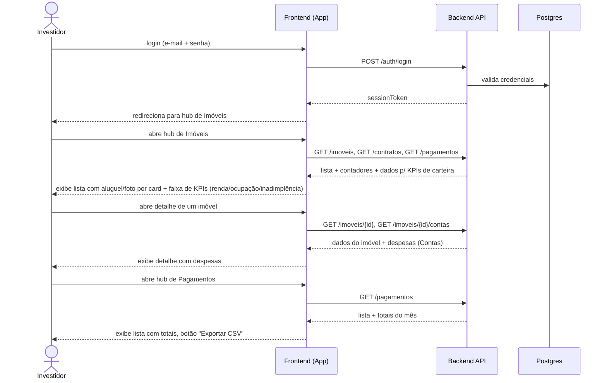
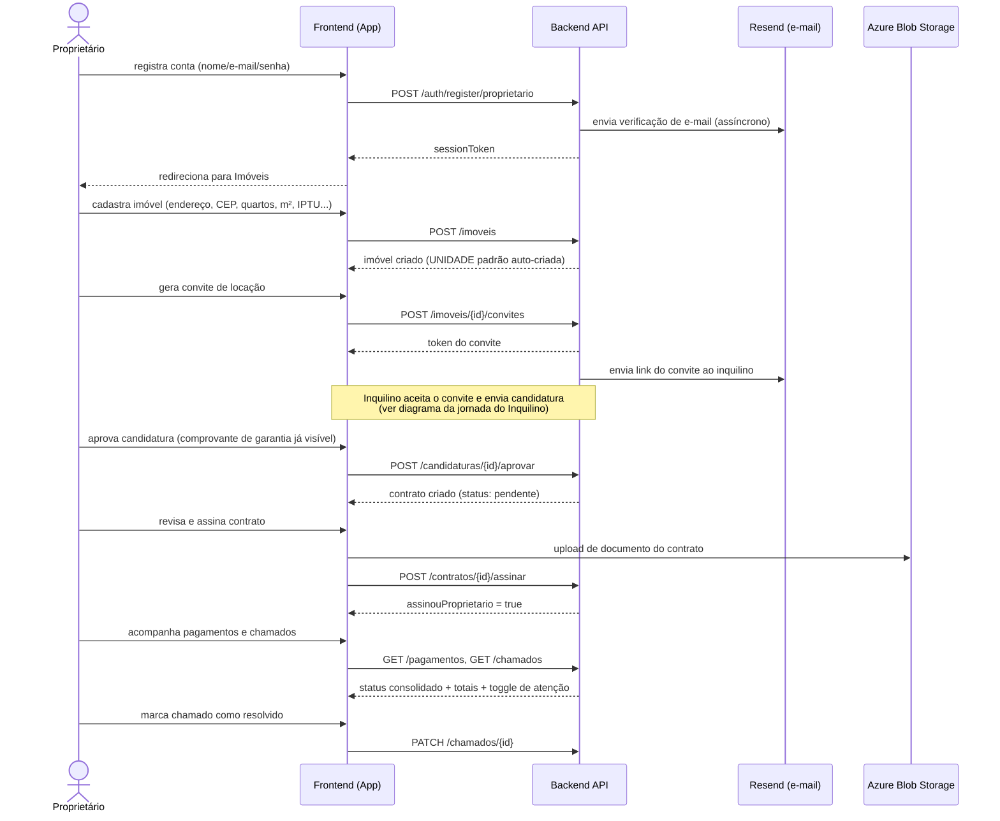
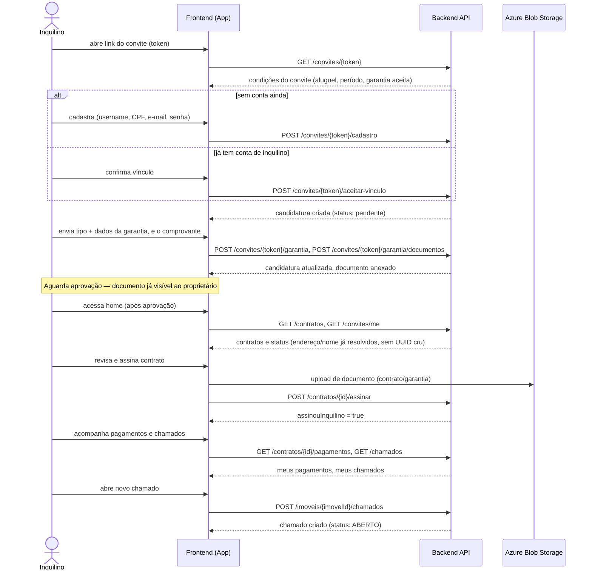

# Jornadas e prioridades de negócio — Investidor, Proprietário e Inquilino

Consolida, sob a ótica de **3 personas de negócio** (em vez das 4 personas operacionais de [`jornadas-e-backlog-tecnico.md`](jornadas-e-backlog-tecnico.md), que inclui Admin/Suporte), o estado **atual** de cada jornada — pontos fortes, pontos fracos, backlog priorizado por impacto de negócio (peso: Proprietário → Investidor → Inquilino, diferente do critério impacto×complexidade×risco do documento irmão) e os prompts de implementação ainda ativos.

**Mapeamento de persona**: "Investidor" cobre quem decide *se vale a pena* ter/expandir a carteira de imóveis; "Proprietário" cobre a operação do dia a dia — cadastrar, convidar, aprovar, assinar, acompanhar; "Inquilino" é o locatário convidado.

**O que já mudou desde a última rodada**: os 4 achados de "correção imediata" (UUIDs crus, rota de perfil quebrada, ordenação de pagamentos, contador de convites), o upload de garantia já na candidatura, o aviso de vencimento de contrato, e a tela de "Contas" já estavam resolvidos. Desde então, **todo o restante do backlog priorizado (itens 4–14) foi concluído**: totais agregados, ação em chamados (os dois lados), card de imóvel com foto/aluguel, busca/filtro, toggle de atenção espalhado, perfil completo, pagamentos do inquilino, painel de carteira (primeira versão), exportação CSV, hardening de API e padronização de erros. Só restam os itens 15 (telemetria) e 16 (wizard), mais um refinamento do painel de carteira (rentabilidade líquida por imóvel).

---

## 1. Investidor

**Quem é**: decide se compra mais um imóvel, se um imóvel específico vale a pena manter, e quer isso em minutos, não em planilha.

**Objetivo da jornada**: abrir o produto e responder "a carteira está rendendo?" — ocupação, receita, inadimplência, despesa — sem precisar somar nada na mão.

### Jornada atual
1. Login → hub de Imóveis, com KPIs de carteira no topo (renda mensal recorrente, taxa de ocupação, inadimplência do mês) e contadores (cadastrados/alugados/vagos)
2. Cada card de imóvel já mostra aluguel vigente e foto, sem precisar abrir o detalhe
3. Abre um imóvel específico para ver a seção "Contas" (despesas — IPTU/condomínio/água/luz, catálogo livre por proprietário)
4. Consulta o hub de Pagamentos, agora com total recebido/pendente do mês e exportação CSV por período

### Diagrama de sequência



### Pontos fortes
- **Onboarding sem fricção desnecessária**: cadastro básico (nome/e-mail/senha) sem exigir CPF/CNPJ na hora — o dado fica opcional até ser realmente necessário (assinar um contrato).
- **CNPJ suportado de verdade**: quem opera como pessoa jurídica já é um caminho de primeira classe, não um workaround.
- **Cadastro de imóvel captura o que sustenta uma decisão de investimento**: quartos, banheiros, vagas, m², IPTU e autofill de CEP.
- **Extrato de pagamentos é confiável**: ordenação cronológica se mantém depois de qualquer confirmação de parcela.
- **Painel de visão de carteira existe**: renda mensal recorrente, taxa de ocupação e inadimplência do mês num único painel no topo do hub de Imóveis — a lacuna mais cara identificada na rodada anterior está fechada na sua primeira versão.
- **"Contas" do imóvel tem tela própria**, escopada por unidade, com responsável (proprietário ou inquilino) e catálogo de tipos livre por proprietário.
- **Exportação de extrato em CSV** no hub de Pagamentos, sem precisar de endpoint novo (gerado no client).
- **Card de imóvel com aluguel vigente e foto**: comparar dois imóveis não exige mais abrir cada um.

### Pontos fracos
- **Sem comparativo de rentabilidade líquida por imóvel** — o painel soma receita e mostra despesa (Contas) separadamente, mas não subtrai uma da outra por imóvel. É o refinamento natural do painel de carteira, ainda não construído.
- **Sem exportação fiscal dedicada** (a exportação CSV existente é um extrato genérico de pagamentos, não formatada para declaração de IR).

### Como melhorar
1. Comparativo de rentabilidade por imóvel (receita do imóvel menos suas Contas) — dado já existe nos dois endpoints (`GET /contratos`, `GET /imoveis/{id}/contas`), é agregação nova no client ou um endpoint de resumo por imóvel.
2. Avaliar, sob demanda, um formato de exportação mais próximo do que declaração de IR exige (categorização por tipo de rendimento).

---

## 2. Proprietário

**Quem é**: gerencia a operação do dia a dia dos próprios imóveis — cadastra, convida inquilino, aprova candidatura, assina contrato, acompanha pagamentos e chamados. Pode ser uma consultora administrando várias carteiras de terceiros ou o dono de 1-2 imóveis.

**Objetivo da jornada**: ir de "tenho um imóvel vago" a "tenho um contrato assinado e sei se o aluguel caiu" com o mínimo de retrabalho manual (planilha, WhatsApp) possível.

### Jornada atual
1. Registro/login → Tabs nativas: Imóveis, Contratos, Pagamentos, Convites, Candidaturas
2. Cadastra imóvel (endereço, cidade, matrícula, tipo, quartos/banheiros/vagas/m²/IPTU, autofill de CEP), com busca e filtros (status, tipo) na lista
3. Gera convite de locação → acompanha status (reenvio/revogação)
4. Aprova ou recusa candidatura, já com o comprobatório de garantia visível antes de decidir
5. Revisa e assina contrato, anexa documento de contrato e de garantia (upload real)
6. Acompanha pagamentos e chamados (agora pode marcar "em andamento"/"resolvido" diretamente na tela), com toggle "precisa de atenção" consistente em Convites, Pagamentos, Contratos e Imóveis

### Diagrama de sequência



### Pontos fortes
- **O fluxo de convite → candidatura → aprovação → contrato → assinatura → pagamento funciona de ponta a ponta**, testado com dados reais e coberto por E2E (golden path).
- **Recuperação de senha, verificação de e-mail e troca de senha proativa** — self-service, mesmo mecanismo de token temporário dos convites; troca de senha estando logado valida a senha atual.
- **Sistema de design consistente e acessível**: status comunicado por cor **e** forma geométrica.
- **Toggle "precisa da minha atenção agora"** consistente em todos os hubs (Convites, Pagamentos, Contratos, Imóveis) — reduz cada hub de "lista pra rolar" pra "o que eu preciso fazer agora".
- **Upload real de documentos** (contrato e garantia) via Azure Blob Storage.
- **Aprovação de candidatura com evidência**: comprovante de garantia visível antes de decidir.
- **Aviso de contrato perto do vencimento** sinalizado visualmente no hub de Contratos, com totais agregados (receita recorrente, assinados, pendentes).
- **Alerta proativo por e-mail (e push, quando o EAS estiver provisionado)**: um job diário avisa automaticamente contrato a 60 dias do fim, garantia a 30 dias e conta a 5 dias — não depende mais de o proprietário lembrar de abrir o app.
- **Chamado de manutenção com ação real**: "marcar em andamento"/"marcar resolvido" na tela de detalhe do imóvel — não é mais só leitura.
- **Lista de imóveis com busca e filtro** (texto, cidade, status, tipo), card com aluguel vigente e foto.
- **Perfil completo**: telefone, CPF/CNPJ, troca de senha proativa.
- **Catálogos de Contas e Categorias de chamado livres por proprietário**, não mais um enum fixo — cada proprietário nomeia o que faz sentido pra ele.

### Pontos fracos
- **Sem wizard de primeiros passos**: um proprietário novo cai direto na lista de Imóveis vazia sem orientação sobre o próximo passo.
- **CRECI/razão social** ainda não têm campo no perfil (adiado deliberadamente — baixo impacto imediato).
- **Push notification ainda não entrega de verdade**: a infraestrutura existe (registro de token, envio via Expo Push Service), mas depende de um projeto EAS que ainda não foi provisionado — até lá, o alerta de vencimento chega só por e-mail.

### Como melhorar
1. Checklist/wizard leve na tela de Imóveis, derivado de dado já existente (tem imóvel? tem convite? tem contrato assinado?) — sem estado novo no backend.
2. CRECI/razão social como campos opcionais no perfil, quando a demanda justificar.
3. Provisionar o projeto EAS (`eas init` + `extra.eas.projectId` em `app.json`) pra destravar o canal de push, que já está implementado.

---

## 3. Inquilino

**Quem é**: locatário convidado pelo proprietário, baixa tolerância a fricção, normalmente usando o produto pela primeira e única vez na vida (o contrato de aluguel).

**Objetivo da jornada**: entender claramente o que precisa fazer em cada etapa, concluir cadastro e assinatura sem ajuda externa, e depois acompanhar contrato/pagamentos/chamados sem precisar perguntar ao proprietário.

### Jornada atual
1. Recebe token de convite → cadastra (username/CPF/e-mail/senha) em uma única chamada, ou só vincula se já tem conta
2. Se o convite exige garantia, envia tipo + dados e pode anexar o comprovante já nesta etapa
3. Acompanha status da candidatura na mesma tela
4. Revisa e assina o contrato, anexa documentos
5. Acessa home com lista de contratos e convites pendentes, perfil com avatar
6. Consulta os próprios pagamentos e abre/acompanha chamados de manutenção

### Diagrama de sequência



### Pontos fortes
- **O caminho principal está completo e testado**: cadastro por convite, garantia, candidatura, assinatura e home com contratos/convites, com E2E cobrindo o caminho ponta a ponta.
- **Upload real de documentos** nos dois pontos do fluxo em que faz sentido: candidatura (comprovante) e revisão do contrato (documento final).
- **Rota de perfil própria** (`/tenant/perfil`), sem colidir com a do proprietário.
- **Home sem IDs técnicos crus**: endereço e nome do proprietário aparecem por extenso.
- **Meus pagamentos**: seção própria, sem precisar perguntar ao proprietário "já venceu?".
- **Abertura e acompanhamento de chamados**: tela própria, restrita a quem tem contrato ativo na unidade do imóvel — fecha o ciclo que antes só existia no backend.

### Pontos fracos
- Nenhum ponto fraco estrutural identificado no caminho principal ou nas duas extensões recém-fechadas (pagamentos, chamados).

### Como melhorar
- Sem item crítico em aberto para esta persona. Próximo refinamento razoável, se a demanda aparecer: notificação proativa (não só painel) quando um pagamento ficar perto do vencimento.

---

## 4. Síntese cross-persona

| Achado | Investidor | Proprietário | Inquilino | Status |
|---|---|---|---|---|
| Visão de carteira ausente | 🔴 Crítico | — | — | ✅ Resolvido (primeira versão) — falta rentabilidade líquida por imóvel |
| "Contas" do imóvel sem tela | 🔴 Crítico | 🟡 Importante | — | ✅ Resolvido |
| Ordenação de pagamentos quebrada | 🟡 Importante | 🟡 Importante | — | ✅ Resolvido |
| Aprovação de candidatura às cegas | — | 🔴 Crítico | 🟡 Indireto (garantia) | ✅ Resolvido |
| UUIDs crus na tela | — | — | 🔴 Crítico | ✅ Resolvido |
| Rota de perfil quebrada | — | — | 🔴 Crítico | ✅ Resolvido |
| Chamados sem ação/abertura | — | 🟡 Importante | 🟡 Importante | ✅ Resolvido (ambos os lados) |
| Vencimento de contrato sem aviso | 🟡 Importante | 🟡 Importante | — | ✅ Resolvido (visual + e-mail proativo; push depende de EAS) |
| Totais/hardening/erros (itens 4–14) | 🟡 vário | 🟡 vário | 🟡 vário | ✅ Resolvido |
| Telemetria de funil por persona | — | — | — | Em aberto |
| Wizard de primeiros passos | — | 🟡 Importante | — | Em aberto |

A leitura executiva mudou desde a rodada anterior: **não há mais nenhuma lacuna estrutural crítica aberta** nas 3 personas de negócio. O que resta é refinamento (rentabilidade líquida, alertas proativos) e infraestrutura de medição (telemetria) — não construção de funcionalidade ausente.

---

## 5. Backlog priorizado (Proprietário → Investidor → Inquilino)

Escala de impacto: 1 (nenhum) a 5 (crítico), por persona.

| # | Item | Tipo | Impacto Proprietário | Impacto Investidor | Impacto Inquilino | Esforço | Prioridade | Status |
|---|---|---|---:|---:|---:|---:|---|---|
| 1 | Upload de garantia na candidatura (antes da aprovação) | Negócio | 5 | 2 | 3 | Médio | P0 | ✅ Concluído |
| 2 | Aviso visual de contrato perto do vencimento (60 dias) | Negócio | 4 | 3 | 1 | Médio | P0 | ✅ Concluído |
| 3 | Tela de "Contas" do imóvel | Ambas | 3 | 5 | 1 | Baixo | P0 | ✅ Concluído |
| 4 | Totais agregados nos hubs de Contratos e Pagamentos | Ambas | 3 | 5 | 1 | Baixo | P1 | ✅ Concluído |
| 5 | Ação real em chamados (proprietário atualiza status; inquilino abre chamado) | Negócio | 3 | 1 | 3 | Médio | P1 | ✅ Concluído |
| 6 | Card de imóvel com aluguel vigente e foto | Negócio | 3 | 3 | 1 | Baixo | P1 | ✅ Concluído |
| 7 | Busca e filtro na lista de imóveis | Negócio | 3 | 2 | 1 | Baixo | P1 | ✅ Concluído |
| 8 | Espalhar o toggle "precisa de atenção" para Contratos e Imóveis | Negócio | 3 | 1 | 1 | Baixo | P1 | ✅ Concluído |
| 9 | Perfil mais completo (telefone, trocar senha proativa) | Ambas | 3 | 1 | 2 | Médio | P2 | ✅ Concluído |
| 10 | Inquilino visualiza os próprios pagamentos | Negócio | 1 | 1 | 4 | Baixo | P1 | ✅ Concluído |
| 11 | Painel de visão de carteira (renda, ocupação, inadimplência) | Ambas | 2 | 5 | 1 | Alto | P1 | ✅ Concluído (1ª versão) — falta rentabilidade líquida por imóvel |
| 12 | Exportação de extrato (CSV) | Negócio | 1 | 4 | 1 | Baixo | P2 | ✅ Concluído |
| 13 | Hardening de contratos de API e isolamento por persona | Técnica | 3 | 3 | 3 | Alto | P2 | ✅ Concluído |
| 14 | Padronização de erros por etapa da jornada | Técnica | 2 | 1 | 2 | Médio | P2 | ✅ Concluído |
| 15 | Instrumentação de funil por persona (telemetria) | Técnica | 2 | 2 | 2 | Alto | P2 | Em aberto |
| 16 | Wizard guiado de primeiros passos (proprietário) | Negócio | 2 | 1 | 1 | Médio | P3 | Em aberto |

Correspondência com o backlog por sprint em [`jornadas-e-backlog-tecnico.md`](jornadas-e-backlog-tecnico.md): itens 5 e 10 = rank 1 (concluído); item 15 = rank 2; item 14 = rank 3 (concluído); itens 2/4/8 = rank 4 (concluído); item 16 = rank 6; item 13 = rank 7 (concluído).

---

## 6. Prompts de implementação — itens ainda em aberto

Os itens 1–14 (mais as 4 correções imediatas da rodada anterior) já foram implementados — o código é a documentação de referência agora, não o prompt original. Só os dois itens abaixo continuam com prompt pronto pra copiar.

### Item 11 (refinamento) — Rentabilidade líquida por imóvel
```text
O painel de carteira (hub de Imóveis) já soma renda mensal recorrente,
ocupação e inadimplência do mês. Falta comparar receita menos despesa por
imóvel — hoje "Contas" (GET /imoveis/{id}/contas) é uma lista separada, sem
nenhuma agregação cruzada com o aluguel do contrato daquele imóvel.

Adicione, na tela de detalhe do imóvel ou como coluna extra na lista, um
cálculo client-side: soma de valorAluguel do contrato ativo da unidade menos
soma de valor das Contas do período corrente. Sem mudança de backend
necessária — os dois dados já são buscados separadamente hoje.
```

### Item 15 — Instrumentação de funil por persona (telemetria)
```text
Não existe hoje nenhum evento de telemetria disparado no frontend ou backend.
Antes de implementar, defina a taxonomia de eventos (nome do evento, persona,
etapa da jornada) usando os fluxos documentados em
docs/jornadas-e-prioridades-negocio.md (seções 1-3, diagramas de sequência)
como base — cada passo numerado de cada diagrama é candidato a um evento.
Decida o destino (log estruturado consumido por uma ferramenta de analytics,
ou um endpoint próprio de eventos) antes de instrumentar qualquer coisa —
este item é pré-requisito de dado pra medir o impacto real de qualquer outro
item deste backlog depois de entregue.
```

### Item 16 — Wizard guiado de primeiros passos (proprietário)
```text
Não existe hoje nenhum guia de primeiros passos — um proprietário novo cai
direto na lista de Imóveis vazia sem nenhuma orientação sobre o que fazer
primeiro. Adicione um checklist/wizard leve (pode ser um componente de
progresso na própria tela de Imóveis, não precisa ser uma tela separada)
guiando: cadastrar primeiro imóvel → gerar primeiro convite → acompanhar
primeira candidatura → assinar primeiro contrato, com marcadores de progresso
baseados em dado já existente (proprietário tem algum imóvel? algum convite?
algum contrato assinado?) — não precisa de estado novo no backend, dá pra
derivar tudo do que já é retornado por GET /imoveis, GET /convites e
GET /contratos.
```
