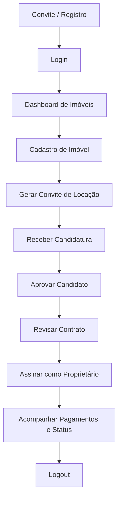
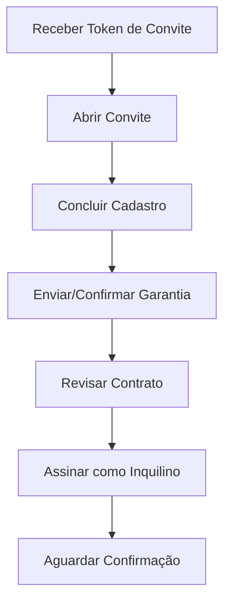
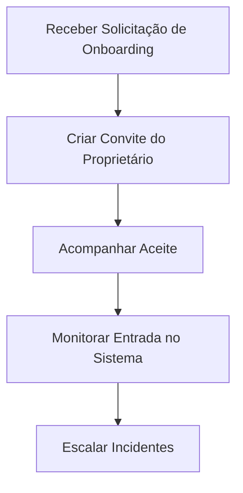
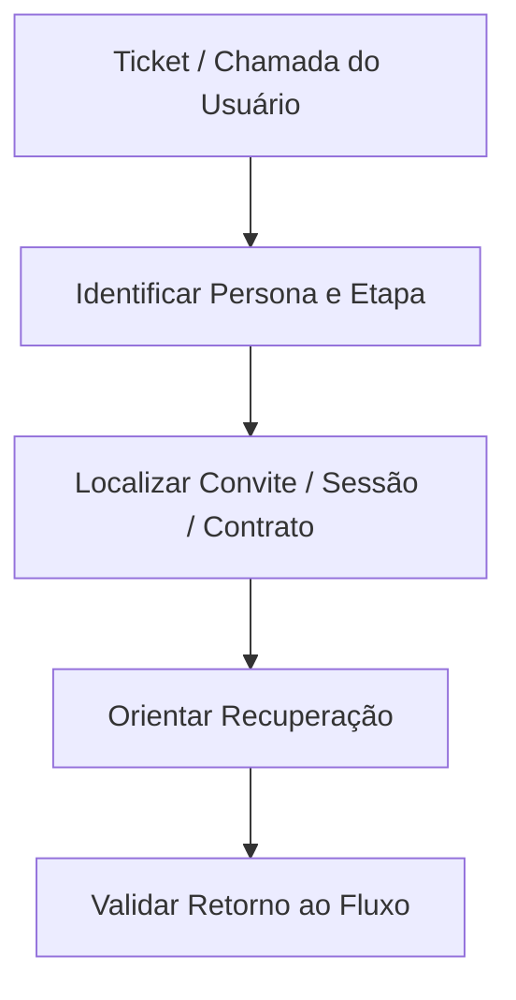
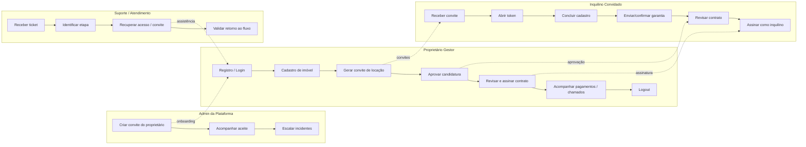

# Journey Map — Plataforma de Gestão de Imóveis

## 1) Objetivo
Mapear a experiência completa do produto por persona, cobrindo:
- estado atual (fluxos já implementados)
- estado alvo (fluxos previstos na especificação)
- riscos/fricções e oportunidades por jornada

---

## 2) Personas

## Persona A — Proprietário Gestor (principal no MVP)
**Quem é**: proprietário pessoa física ou pequena administradora, quer organizar imóveis e contratos com pouco tempo.

**Objetivos**:
- entrar rapidamente na plataforma
- cadastrar imóvel sem burocracia
- convidar inquilino certo
- formalizar contrato e acompanhar status

**Dores**:
- medo de erro em documentação/garantia
- falta de visibilidade do andamento (convite, assinatura, pagamentos)
- retrabalho em processos manuais

**Critérios de sucesso**:
- consegue ir de cadastro a contrato assinado sem suporte
- visualiza status do imóvel e contrato em poucos cliques

---

## Persona B — Inquilino Convidado
**Quem é**: locatário convidado pelo proprietário, com baixa tolerância a fricção.

**Objetivos**:
- concluir cadastro/acesso com segurança
- enviar dados mínimos e assinar convite/contrato
- entender claramente o próximo passo

**Dores**:
- fluxo longo e com linguagem jurídica
- incerteza sobre status da proposta
- erro em token/convite expirado

**Critérios de sucesso**:
- conclui cadastro + assinatura sem precisar de ajuda
- recebe confirmação clara de conclusão

---

## Persona C — Admin da Plataforma (operacional)
**Quem é**: operação interna que habilita onboarding inicial de proprietários e suporte.

**Objetivos**:
- convidar proprietário com confiabilidade
- reduzir chamados de suporte em onboarding
- monitorar sucesso/erro por etapa

**Dores**:
- dependência de processos manuais
- baixa observabilidade do funil de onboarding

**Critérios de sucesso**:
- alta taxa de aceitação de convite
- baixo volume de tickets por erro de convite/autenticação

---

## Persona D — Suporte/Atendimento (interna)
**Quem é**: time que ajuda quando há falhas de acesso, convite e assinatura.

**Objetivos**:
- diagnosticar rapidamente em qual etapa o usuário travou
- orientar recuperação de fluxo sem intervenção técnica

**Dores**:
- pouca telemetria funcional por estágio da jornada
- inconsistências entre front e backend

**Critérios de sucesso**:
- MTTR baixo para problemas de acesso/convite
- playbook claro por tipo de incidente

---

## 3) Mapa de Fluxos por Persona (Estado Atual)

## A) Proprietário Gestor — Fluxos Implementados

### A1. Registro direto do proprietário (self-service)
1. Acessa tela de cadastro
2. Informa nome, CPF/CNPJ, e-mail e senha
3. Sistema valida dados
4. Conta é criada e sessão iniciada
5. Redireciona para lista de imóveis

**Touchpoints**: UI de registro, API de registro, sessão local.

**Fricções atuais**:
- erro de validação pode aparecer só ao submit final
- ausência de confirmação explícita de sucesso além do redirect

### A2. Login
1. Acessa login
2. Informa e-mail + senha
3. Sistema autentica e cria sessão
4. Redireciona para área de imóveis

**Touchpoints**: UI login, API auth/login, storage de sessão.

**Fricções atuais**:
- mensagens de erro dependem do payload da API

### A3. Cadastro de imóvel
1. Proprietário entra em “+ Novo imóvel”
2. Informa endereço, cidade, matrícula
3. Salva imóvel
4. Retorna para lista com status do imóvel

**Touchpoints**: formulário, API de imóveis.

**Fricções atuais**:
- visibilidade está preparada, mas no MVP ainda é operação fechada por convite

### A4. Revisão e assinatura de contrato (lado proprietário)
1. Abre contrato
2. Revisa dados (tipo, aluguel, período, status)
3. Anexa/substitui o documento do contrato e documentos de garantia (upload real, Azure Blob Storage)
4. Assina como proprietário
5. Acompanha status até assinatura total

**Touchpoints**: tela de contrato, API de assinatura, API de documentos (`/contratos/{id}/documento`, `/contratos/{id}/garantia/documentos`), status.

**Fricções atuais**:
- contexto jurídico simplificado no MVP

### A5. Navegação por hubs (Tabs)
1. Após login, proprietário navega por Tabs nativas: Imóveis, Contratos, Pagamentos, Convites, Candidaturas
2. Cada hub lista os registros do proprietário logado, com ações rápidas (reenviar/revogar convite, aprovar/recusar candidatura, confirmar pagamento)
3. Acessa perfil (avatar clicável no header) e detalhe de inquilino a partir do link do imóvel alugado, sem esses aparecerem na tab bar

**Touchpoints**: `(owner)/_layout.tsx` (Tabs), hubs `contratos/`, `pagamentos/`, `convites/`, `candidaturas/`, `perfil/`, `inquilinos/[id]`.

**Fricções atuais**:
- sem wizard guiado de primeiros passos (rank 6 do plano de execução, ainda não iniciado)

### A6. Perfil e avatar
1. Acessa "Meu perfil" pelo avatar no header
2. Troca a foto (upload real via Azure Blob Storage, container público)
3. Avatar atualizado aparece imediatamente no header

**Touchpoints**: `(owner)/perfil/index.tsx`, `POST /auth/avatar`.

### A7. Logout
1. Clica em “Sair”
2. Front chama API de logout
3. Backend invalida token atual
4. Front limpa sessão local e redireciona para login

**Touchpoints**: botão sair, API auth/logout, sessão local.

**Fricções atuais**:
- em falha de rede, logout local ocorre mesmo sem confirmação server-side (trade-off intencional)

---

## B) Inquilino Convidado — Fluxos Implementados/Parciais

### B1. Acesso por convite de locação
1. Recebe token de convite (`(contrato)/locacao/[token].tsx`)
2. Abre a rota do convite; se não tem conta, cadastra com senha (username/CPF/e-mail/senha) em uma única chamada; se já tem conta de inquilino, só vincula (`aceitar-vinculo`)
3. Se o convite exige garantia, envia tipo + dados da garantia
4. Acompanha o status da candidatura (aguardando aprovação) na mesma tela

**Touchpoints**: `(contrato)/locacao/[token].tsx`, `POST /convites/{token}/cadastro`, `POST /convites/{token}/aceitar-vinculo`, `POST /convites/{token}/garantia`, `GET /convites/me`.

**Fricções atuais**:
- envio dos **documentos comprobatórios** da garantia (RG, comprovante de renda etc.) ainda não tem UI nesta etapa — só o tipo/dados em JSON; o upload real de arquivo de garantia só existe mais adiante, na revisão do contrato (B2), depois que ele já foi criado

### B2. Assinatura de locação por convite / revisão de contrato
1. Acessa token de locação ou o link direto do contrato (`(contrato)/[id]/revisar.tsx`)
2. Revisa resumo do contrato
3. Confere/anexa documentos (do contrato e de garantia, upload real)
4. Assina como inquilino
5. Recebe confirmação

**Touchpoints**: tela de locação por token, tela de revisão de contrato, API de assinatura por convite/sessão, API de documentos.

**Fricções atuais**:
- dependência de token válido e não expirado

### B3. Home do inquilino (área logada)
1. Faz login
2. Vê lista de contratos (com status de assinatura e dados do imóvel/proprietário)
3. Vê convites pendentes vinculados à conta e pode aceitá-los
4. Acessa perfil (avatar) e faz logout

**Touchpoints**: `(tenant)/tenant/index.tsx`, `GET /contratos`, `GET /convites/me`.

**Fricções atuais**:
- sem abertura/acompanhamento de chamados nesta tela ainda (backend cobre, UI não — ver `docs/plano-execucao-ajustes.md`)

### B4. Perfil e avatar do inquilino
1. Acessa "Meu perfil"
2. Troca a foto (upload real via Azure Blob Storage)

**Touchpoints**: `(tenant)/perfil.tsx`, `POST /auth/avatar`.

---

## C) Admin da Plataforma — Fluxos Implementados

### C1. Convite de onboarding de proprietário
1. Cria convite com dados do proprietário
2. Sistema gera token
3. Proprietário recebe link/token por canal operacional
4. Proprietário conclui cadastro e ativa acesso

**Touchpoints**: endpoint de convite, observabilidade operacional.

**Fricções atuais**:
- envio transacional real (SMTP) ainda fora do escopo, com stubs/processo manual

---

## D) Suporte/Atendimento — Fluxos Implementados

### D1. Recuperação operacional de convite (ambiente de teste)
1. Busca token em endpoint de suporte
2. Reenvia para usuário de teste
3. Usuário retoma fluxo

**Touchpoints**: endpoints de test-support.

**Fricções atuais**:
- recursos de suporte em produção dependem de canais operacionais fora do escopo MVP

---

## 4) Mapa de Fluxos (Estado Alvo da Especificação)

## A) Proprietário Gestor (to-be)
- onboarding por convite da plataforma
- login recorrente
- cadastro de imóvel
- geração de convite de locação
- aprovação/recusa de candidatura
- assinatura de contrato
- visão de pagamentos (pendente/pago/atrasado)
- gestão de contas do imóvel
- gestão de chamados de manutenção
- alertas: garantia, reajuste, vencimentos

## B) Inquilino (to-be)
- cadastro via convite
- envio de dados/documentos/garantia
- acompanhamento da candidatura
- assinatura de contrato
- visão dos próprios contratos e pagamentos
- abertura/acompanhamento de chamados

## C) Admin da Plataforma (to-be)
- gestão de onboarding de proprietários
- trilha de auditoria de convites/aceites
- monitoramento de SLA por etapa

## D) Suporte (to-be)
- painel de diagnóstico por jornada
- ações guiadas de recuperação (reenvio convite, expiração, reabertura)

---

## 5) Journey Map por Etapa (Cross-persona)

| Etapa | Persona líder | Objetivo do usuário | Estado emocional típico | Risco de abandono | Oportunidade de melhoria |
|---|---|---|---|---|---|
| Descoberta/Convite | Admin / Proprietário | Iniciar acesso com segurança | Expectativa + dúvida | Médio | Mensagens mais claras de próximo passo |
| Cadastro/Aceite | Proprietário / Inquilino | Concluir conta sem erro | Atenção | Alto | Validação progressiva + exemplos inline |
| Primeiro acesso | Proprietário | Entrar e entender onde agir | Alívio + ansiedade | Médio | Checklist “primeiros 5 minutos” |
| Operação inicial | Proprietário | Cadastrar imóvel e convidar inquilino | Foco | Médio | Wizard guiado por etapas |
| Contratação | Proprietário + Inquilino | Assinar com segurança jurídica | Cautela | Alto | Resumo executivo + cláusulas destacadas |
| Pós-assinatura | Proprietário | Acompanhar pagamentos e status | Controle | Médio | Painel com alertas acionáveis |
| Suporte | Suporte interno | Resolver bloqueios rapidamente | Urgência | Alto | Telemetria de funil + códigos de erro amigáveis |

---

## 6) Fluxos Críticos (prioridade de produto)

1. Convite/Aceite de acesso
2. Login + sessão + logout seguro
3. Cadastro de imóvel
4. Convite de locação e candidatura
5. Aprovação + geração de contrato
6. Assinatura das partes
7. Geração e acompanhamento de pagamentos

---

## 7) KPIs recomendados por persona

## Proprietário
- taxa de conclusão: cadastro -> primeiro imóvel criado
- tempo médio: login -> convite de locação emitido
- taxa de contratos assinados após convite

## Inquilino
- taxa de conclusão do convite
- tempo médio para assinatura
- taxa de abandono por etapa (convite, garantia, assinatura)

## Admin/Suporte
- taxa de aceitação de convites de onboarding
- volume de tickets por etapa
- tempo médio de resolução de incidentes de acesso

---

## 8) Backlog de experiência (curto prazo)

1. Exibir “status do logout” com feedback explícito na UI (sucesso/instabilidade)
2. Padronizar mensagens de erro por etapa da jornada
3. Instrumentar eventos de funil por persona
4. ~~Criar tela de status de candidatura para inquilino (UX completa)~~ — **concluído**: `(tenant)/tenant/index.tsx` já mostra convites/candidaturas vinculados e seu status
5. Consolidar mapa de rotas e permissões por persona em documentação viva — **avançado**: seção 5 de `docs/gerenciador-imoveis-initial-prompt.md` foi atualizada com a superfície de API real; falta a matriz explícita rota × persona (rank 7 do plano de execução)
6. Criar UI de chamados para o inquilino (abrir/acompanhar) — backend já cobre, front só existe do lado do proprietário

---

## 9) Journey Map em Mermaid

### 9.1 Proprietário Gestor

### 9.2 Inquilino Convidado

### 9.3 Admin da Plataforma

### 9.4 Suporte / Atendimento

---

## 10) Matriz RACI

Legenda: **R** = Responsible, **A** = Accountable, **C** = Consulted, **I** = Informed

| Etapa / Fluxo | Proprietário Gestor | Inquilino Convidado | Admin da Plataforma | Suporte / Atendimento |
|---|---|---|---|---|
| Convite de onboarding do proprietário | I | I | A/R | C |
| Registro/login do proprietário | A/R | I | I | C |
| Cadastro de imóvel | A/R | I | I | I |
| Geração de convite de locação | A/R | I | I | I |
| Cadastro do inquilino via convite | I | A/R | I | C |
| Envio/validação de garantia | I | A/R | I | C |
| Aprovação de candidatura | A/R | I | I | C |
| Revisão/assinatura de contrato | A/R | A/R | I | I |
| Geração e acompanhamento de pagamentos | A/R | I | I | I |
| Gestão de chamados | A/R | A/R | I | C |
| Logout / encerramento de sessão | A/R | A/R | I | I |
| Recuperação de convite / incidente de acesso | I | I | I | A/R |

---

## 11) Resumo executivo
O MVP atual já cobre o coração da jornada do **proprietário** (agora com navegação por Tabs/hubs, perfil com avatar e documentos de contrato/garantia) e a maior parte da jornada do **inquilino** — cadastro por convite, garantia, candidatura, assinatura, home com contratos/convites e perfil com avatar já têm UI própria. O que resta no front do inquilino é essencialmente **chamados de manutenção** (abrir/acompanhar) e o **upload dos documentos comprobatórios da garantia** ainda na etapa de candidatura (hoje só depois, na revisão do contrato). O roadmap natural é fechar essas duas lacunas e adicionar observabilidade operacional para **admin** e **suporte**.

---

## 12) Journey visual consolidado

---

## 13) Dor, oportunidade e requisito

| Etapa | Dor principal | Oportunidade | Requisito derivado |
|---|---|---|---|
| Convite de onboarding | Usuário não sabe o próximo passo | Orientar com CTA claro e status visível | Exibir tela/fluxo com instruções objetivas e confirmação de aceite |
| Registro / login | Erros de credencial e cadastro geram abandono | Validar antes do submit e explicar erros | Validação declarativa + mensagens específicas por campo |
| Cadastro de imóvel | Formulário pode parecer longo | Reduzir esforço com campos mínimos e feedback imediato | Formulário curto, salvos rápidos e confirmação de sucesso |
| Geração de convite de locação | Proprietário não entende se convite foi criado | Mostrar token/status e permitir retomada | Expor confirmação da criação do convite e seu estado |
| Cadastro do inquilino | Medo de preencher algo errado | Guiar com linguagem simples e progressão clara | Suporte a cadastro por convite com validação passo a passo |
| Garantia | Garantia é um ponto jurídico sensível | Tornar a escolha objetiva e limitada | Permitir apenas um tipo de garantia por contrato |
| Aprovação de candidatura | Processo depende de conferência manual | Automatizar checagem de conflito de datas | Bloquear aprovação com contrato sobreposto na unidade |
| Revisão / assinatura | Documentação pode parecer complexa | Resumir contrato e destacar campos críticos | Tela de revisão com resumo legível e assinatura por parte |
| Pagamentos | Estado financeiro é difícil de entender | Consolidar status em um painel único | Listar pagamentos por contrato e sinalizar atraso |
| Chamados | Suporte é reativo e fragmentado | Centralizar abertura e andamento do chamado | Fluxo de chamados por imóvel com status atualizado |
| Logout | Encerramento de sessão precisa ser confiável | Garantir saída local e servidor | Endpoint de logout + limpeza da sessão local |
| Recuperação de acesso | Convite expirado ou perdido trava o fluxo | Criar rota de recuperação e suporte | Fluxo de suporte para localizar/recuperar convites |