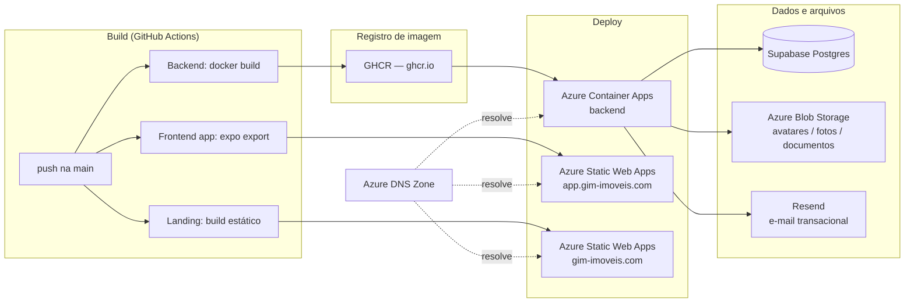

# Provisionamento — do build ao deploy, e o que cada recurso custa

Este documento complementa `docs/deploy-azure.md` (que é o runbook operacional — como rodar os scripts, gotchas, troubleshooting). Aqui o objetivo é outro: dar uma visão executiva de **quais recursos de infraestrutura existem, por que existem, e quanto custam**, do momento em que um commit é enviado até o momento em que ele está servindo tráfego real.

## 1. Visão geral da arquitetura

Três times de build correm em paralelo a cada push na `main` (cada um só dispara se os arquivos do seu escopo mudaram): **backend** (Container Apps), **app** (Static Web Apps) e **landing** (segundo Static Web Apps, domínio raiz). O banco (Supabase) e o e-mail transacional (Resend) ficam fora do Azure — não existe tier gerenciado always-free de Postgres no Azure, e o Resend já resolvia bem o envio de e-mail antes de qualquer decisão de infraestrutura.

## 2. Do commit ao ar — passo a passo

1. **Push na `main`** dispara os workflows relevantes em `.github/workflows/` conforme o path do commit (mudança em `backend/**` só dispara o workflow do backend, e assim por diante).
2. **Backend**: `docker build` a partir de `backend/Dockerfile` (empacotamento em camadas do Micronaut, não um `-all.jar`) → `docker push` para o **GHCR** → `az containerapp update --image ...` aponta a revisão ativa do Container App pra imagem nova. Não há downtime programado (Container Apps troca de revisão), mas também não há blue/green real — é um único Container App em `activeRevisionsMode: Single`.
3. **Frontend (app)**: `expo export` (build estático do React Native for Web) → deploy para o Static Web App `gim-frontend`, servido em `app.gim-imoveis.com`. A URL pública do backend é **embutida no bundle em build-time** (`EXPO_PUBLIC_API_URL`) — mudar a URL do backend exige rebuild do frontend, não só reiniciar nada.
4. **Landing**: HTML estático simples (sem build de verdade) → deploy para o segundo Static Web App `gim-landing`, servido no domínio raiz `gim-imoveis.com`. Existe como recurso separado porque um Static Web App só serve **um** conteúdo por todos os domínios vinculados a ele — não dá pra ter o app e a landing saindo do mesmo recurso em domínios diferentes.
5. **Schema do banco**: o backend roda as migrations do Flyway (`backend/src/main/resources/db/migration/`) no próprio boot, contra o Supabase — não é um passo separado do pipeline. `HIBERNATE_DDL_AUTO=validate` em produção garante que o Hibernate nunca altera o schema, só confere.
6. **Arquivos** (avatar, foto de imóvel, documento de contrato/garantia) vão direto do backend para o Azure Blob Storage via `AZURE_STORAGE_CONNECTION_STRING` — não passam pelo pipeline de deploy, são runtime.

## 3. Como os recursos foram provisionados

Provisionamento inicial e reaplicação segura é feita por `deploy/azure-setup.sh` (idempotente — pode rodar de novo sem quebrar nada existente), com uma parte declarativa e uma imperativa:

- **Declarativo (Bicep, `deploy/bicep/`)**: só os recursos onde reaplicar é comprovadamente um no-op seguro — o **Container Apps environment** (+ Log Analytics) e a **Storage Account** (+ 3 containers). Ver `docs/deploy-azure.md` seção "Bicep" para o porquê de tudo mais ficar de fora (credencial de pull do GHCR não é legível de volta, Static Web Apps têm propriedades de deploy sensíveis, DNS depende de fluxo assíncrono de validação).
- **Imperativo (`az cli`)**: o Container App do backend, os dois Static Web Apps, a zona DNS/domínio customizado (`deploy/azure-custom-domain.sh`) e o service principal usado pelo GitHub Actions.
- **Manual**: criação do projeto Supabase (precisa de conta pessoal, não scriptável sem token), e o registro do domínio `gim-imoveis.com` em si (feito num registrador externo, fora do Azure).

## 4. Tabela de recursos e custos

Valores de referência (não são uma cobrança monitorada em tempo real — conferir o portal do Azure/Supabase/Resend para o custo real corrente). "MVP" assume o volume de tráfego atual do projeto: poucos usuários, backend escalando a zero quando ocioso.

| Recurso | Função | Como é provisionado | Tem custo? | Custo estimado (volume atual) |
|---|---|---|---|---|
| Azure Static Web Apps — app (`gim-frontend`) | Hospeda o frontend (Expo web) em `app.gim-imoveis.com` | Imperativo, SKU **Free** | Não | R$ 0 |
| Azure Static Web Apps — landing (`gim-landing`) | Hospeda a landing estática em `gim-imoveis.com` | Imperativo, SKU **Free** | Não | R$ 0 |
| Azure Container Apps — backend (`gim-backend`) | Hospeda a API Micronaut (container) | Imperativo, plano **Consumption** | Parcial | Dentro da faixa gratuita mensal (~180.000 vCPU-s / 360.000 GiB-s / 2M requisições) na maior parte do tempo — `minReplicas: 0` (escala a zero quando ocioso); overage é cobrado por segundo de uso além da faixa |
| Container Apps Environment + Log Analytics | Ambiente gerenciado do Container App + logs | Declarativo (Bicep) | Parcial | Log Analytics tem ~5 GB/mês de ingestão grátis (Azure Monitor); acima disso, cobrança por GB ingerido |
| Azure Storage Account (Blob, `Standard_LRS`) | Avatares e fotos de imóvel (público), documentos de contrato/garantia (privado, URL assinada) | Declarativo (Bicep) | Sim | Pay-as-you-go, fração de centavo por GB/mês em hot tier — para o volume atual (poucos GB), centavos por mês |
| GitHub Container Registry (GHCR) | Registro da imagem Docker do backend | N/A (GitHub) | Não | R$ 0 — grátis dentro do limite de uso de pacotes do GitHub para este repositório |
| Supabase Postgres | Banco relacional (schema via Flyway) | Manual (console Supabase) | Não (tier atual) | R$ 0 — tier Free (limite de ~500 MB e de conexões diretas simultâneas) |
| Azure DNS Zone | Zona DNS de `gim-imoveis.com` (CNAME `app`/`api`, TXT de verificação, apex da landing) | Imperativo (`azure-custom-domain.sh`) | Sim | ~US$ 0,50/mês por zona hospedada + fração de centavo por milhão de consultas |
| Resend (e-mail transacional) | Envio de convites, verificação de e-mail, redefinição de senha | Externo ao Azure | Não (tier atual) | R$ 0 — tier Free (100 e-mails/dia, ~3.000/mês) |
| Registro do domínio `gim-imoveis.com` | Propriedade do domínio | Externo (registrador) | Sim | Custo anual do registrador — variável, fora do escopo deste repositório |
| GitHub Actions (CI/CD) | Build e deploy automatizado (3 workflows) | N/A | Não (uso atual) | R$ 0 — dentro do limite gratuito de minutos de execução para o volume de commits atual |

**Leitura executiva**: no volume atual (MVP, poucos usuários ativos), a operação roda essencialmente em **zero custo direto de infraestrutura de aplicação** — os únicos itens com cobrança real e previsível são a zona DNS (~US$ 0,50/mês) e o registro anual do domínio, ambos irrisórios. O ponto de atenção para o futuro não é "ligar mais recursos pagos" — é o **Container Apps sair da faixa gratuita mensal** conforme o tráfego crescer (e aí a conversa muda de "custo zero" para "custo proporcional a uso", o que é o comportamento esperado de um plano Consumption) e o **Supabase free tier** ficar pequeno demais em volume de dados ou conexões simultâneas, o que exigiria upgrade de plano.

## 5. O que fica fora do Azure, e por quê

- **Banco de dados** (Supabase): Azure não oferece um Postgres gerenciado com tier always-free equivalente; Supabase resolve isso sem custo no volume atual.
- **E-mail transacional** (Resend): infraestrutura de envio (SPF/DKIM/DMARC) já validada e mais simples de operar do que montar isso via Azure Communication Services para o volume atual.
- **Registro de domínio**: DNS é gerenciado no Azure, mas a *propriedade* do domínio em si é de um registrador externo — nenhum provedor de nuvem vende domínios diretamente como registrador primário nesse fluxo.
